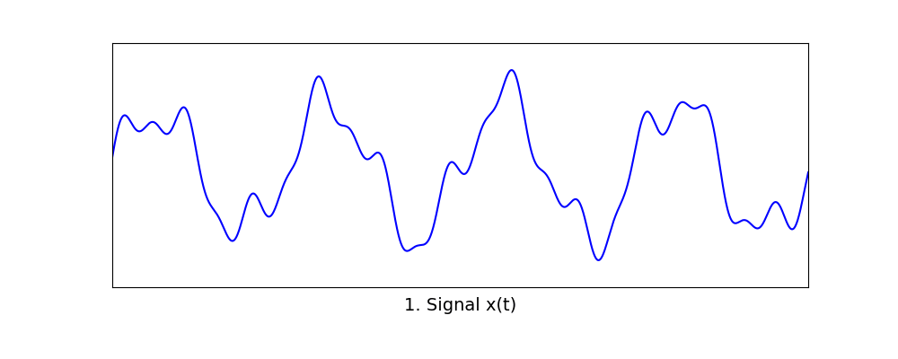
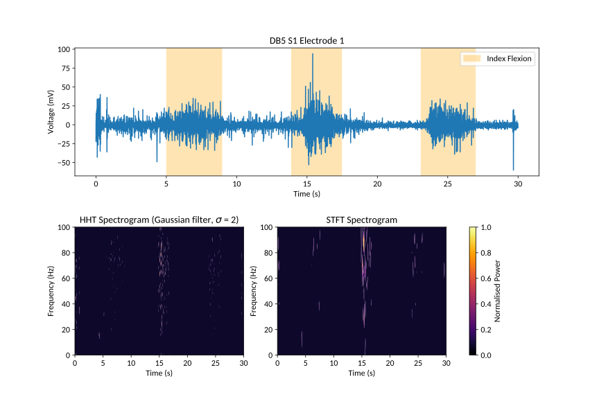
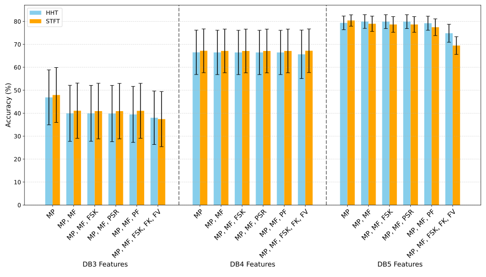
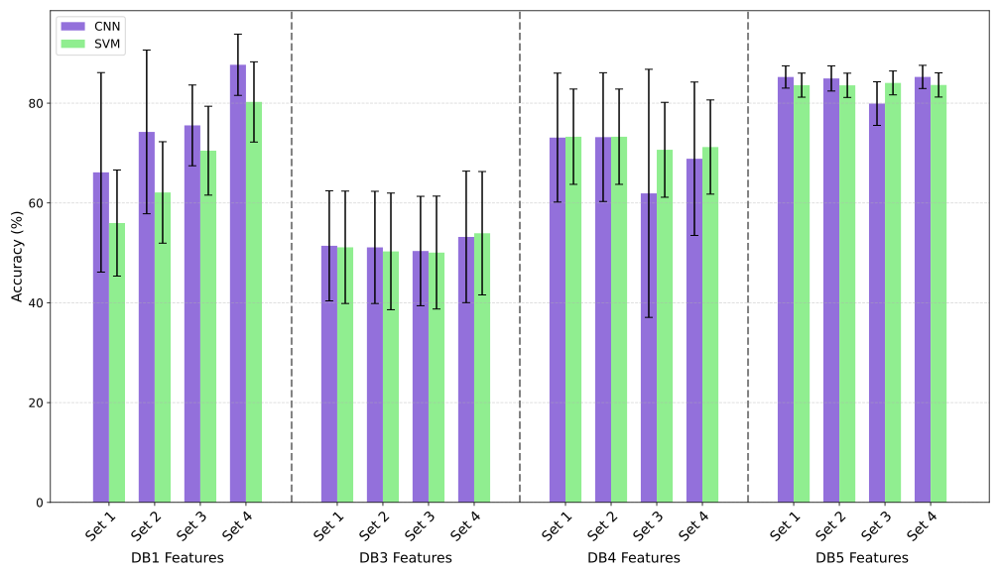

# sEMG Hand Gesture Classification with the Hilbert–Huang Transform

Classifying hand gestures from surface electromyography (sEMG) signals in the [Ninapro](https://ninapro.hevs.ch/) dataset, comparing time–frequency features from the **Hilbert–Huang Transform (HHT)** with the **Short-Time Fourier Transform (STFT)**, and comparing a **Support Vector Machine (SVM)** with a **Convolutional Neural Network (CNN)**.

## Contents

1. [Overview](#overview)
2. [Repository Files](#repository-files)
3. [Hilbert–Huang Transform](#hilberthuang-transform)
    - [Empirical Mode Decomposition](#empirical-mode-decomposition-emd)
    - [Hilbert Transform as an FIR Filter](#hilbert-transform-as-an-fir-filter)
4. [HHT vs STFT](#hht-vs-stft)
5. [Results](#results)
    - [HHT vs STFT Frequency Features](#hht-vs-stft-frequency-features)
    - [SVM vs CNN](#svm-vs-cnn)
6. [References](#references)

## Overview

| Step | Details |
|---|---|
| Data | Ninapro DB1, DB3, DB4 and DB5. DB3 and DB4 are downsampled from 2 kHz to 200 Hz; DB5 is recorded at 200 Hz; DB1 at 100 Hz |
| Train/test split | By repetition: trials 1, 3, 4, 6 for training and 2, 5 for testing (DB1: 1, 3, 4, 6, 7, 8, 9 / 2, 5, 10) |
| Windowing | 40-sample windows with a step of 2 samples (200 ms / 10 ms at 200 Hz) |
| Time–frequency | HHT (CEEMDAN + FIR Hilbert filter) and STFT (Hann window) |
| Features | Time-domain and frequency-domain features per electrode |
| Classifiers | SVM and CNN |

## Repository Files

The code is split into **preprocessing scripts** (Python) and **machine learning notebooks** (Jupyter, run on Google Colab). DB1 has its own version of most files because its train/test split is done differently: in the notebooks, rather than during feature extraction.

### Preprocessing

All preprocessing scripts assume the original `.mat` files have been downloaded from [Ninapro](https://ninapro.hevs.ch/) and placed in subfolders named after each database, e.g. `DB3/Electrode Data/` or `DB4/Electrode Data/`, with the scripts in the parent folder.

| File | Description |
|---|---|
| [`train_test_split.py`](train_test_split.py) | Helper functions used by the preprocessing scripts to split DB3, DB4 and DB5 into train/test trials |
| [`HHT.py`](HHT.py) | Multi-threaded HHT: decomposes each electrode's signal with CEEMDAN and builds the Hilbert spectrum. Very slow (days for exercises E1–E3) |
| [`HHT_feature_extraction.py`](HHT_feature_extraction.py) | Extracts frequency features (MP, MF, FV, FSK, FK, PF, PSR) from the HHT spectrum. DB3, DB4 and DB5 |
| [`HHT_DB1_feature_extraction.py`](HHT_DB1_feature_extraction.py) | As above, for DB1 |
| [`STFT_feature_extraction.py`](STFT_feature_extraction.py) | Multi-threaded STFT; extracts the same 7 frequency features. DB3, DB4 and DB5 |
| [`STFT_DB1_feature_extraction.py`](STFT_DB1_feature_extraction.py) | As above, for DB1 |
| [`feature_extraction.py`](feature_extraction.py) | Extracts the time-domain features (MAV, MAVS, WL, WAMP, ZC, AR1–AR4, RMS, SSC, VAR, IEMG). DB3, DB4 and DB5 |
| [`DB1_feature_extraction.py`](DB1_feature_extraction.py) | As above, for DB1 |

### Machine Learning

The notebooks expect the extracted features to be saved on Google Drive. The different feature sets are left commented out in each notebook so they can be swapped in and out.

| File | Description |
|---|---|
| [`SVM.ipynb`](SVM.ipynb) | SVM classifier. DB3, DB4 and DB5 |
| [`SVM_DB1.ipynb`](SVM_DB1.ipynb) | SVM classifier for DB1 |
| [`CNN.ipynb`](CNN.ipynb) | CNN classifier. DB3, DB4 and DB5 |
| [`CNN_DB1.ipynb`](CNN_DB1.ipynb) | CNN classifier for DB1 |

## Hilbert–Huang Transform

The HHT is an adaptive time–frequency method for non-linear, non-stationary signals such as sEMG (Huang et al., 1998). It has two stages:

1. **Empirical Mode Decomposition (EMD)** splits the signal into a set of *Intrinsic Mode Functions (IMFs)*, each a narrow-band oscillation.
2. The **Hilbert transform** of each IMF gives its instantaneous amplitude and frequency at every sample.

### Empirical Mode Decomposition (EMD)



1. Start with the signal $x(t)$.
2. Identify all local maxima and minima.
3. Interpolate the upper and lower envelopes with cubic splines.
4. Take the mean of the envelopes, $m(t)$.
5. Subtract it: $h(t) = x(t) - m(t)$.
6. Repeat steps 2–5 on $h(t)$ (*sifting*) until it is an IMF, i.e.
    - the number of extrema and zero-crossings differ by at most one, and
    - the mean envelope is approximately zero.

    In practice, sifting stops when the standard deviation between two successive sifts falls below a threshold (typically 0.2). Then subtract the IMF from $x(t)$ and repeat on the residual until it is monotonic.

The pipeline ([`HHT.py`](HHT.py)) uses **CEEMDAN** (Complete Ensemble EMD with Adaptive Noise), which averages the decomposition over many noise-added copies of the signal to reduce *mode mixing*, with Akima splines in place of cubic splines for the envelopes.

### Hilbert Transform as an FIR Filter

The Hilbert transform shifts every frequency component of a signal by $-90^\circ$:

```math
\hat{x}(t) = \frac{1}{\pi}\,\mathrm{p.v.}\!\int_{-\infty}^{\infty} \frac{x(\tau)}{t-\tau}\,d\tau
```

In discrete time this is a convolution with an infinitely long impulse response, $h[n] = 2/(\pi n)$ for odd $n$ and $0$ for even $n$. It was realised as a 41-tap FIR filter by truncating $h[n]$ and applying a Hann window.

Each IMF $c(t)$ and its Hilbert transform $\hat{c}(t)$ form the *analytic signal* $z(t)$, which gives the instantaneous amplitude $a(t)$ and frequency $f(t)$ at every sample:

```math
z(t) = c(t) + j\,\hat{c}(t) = a(t)\,e^{j\theta(t)},
\qquad
f(t) = \frac{1}{2\pi}\frac{d\theta}{dt}
```

The **Hilbert spectrum** is built by placing the energy $a^2(t)$ of every IMF in the frequency bin nearest $f(t)$.

## HHT vs STFT



*DB5, subject 1, electrode 1, during three repetitions of index flexion. Left: HHT spectrum (Gaussian-smoothed, $\sigma = 2$). Right: STFT spectrogram.*

The **STFT** has a fixed time–frequency trade-off. With a window of $N$ samples:

```math
\Delta f = \frac{f_s}{N}, \qquad \Delta t = \frac{N}{f_s}, \qquad \Delta t\,\Delta f = 1
```

A 40-sample window at 200 Hz gives 200 ms time resolution but only 5 Hz frequency bins (21 bins from 0 to 100 Hz). Narrower bins need a longer window, which blurs the timing.

The **HHT** has no such trade-off. Instantaneous frequency is computed at every sample, so the number of frequency bins is a free choice. This project uses $f_s$ bins between 0 and $f_s/2$, giving **0.5 Hz bins** at 200 Hz (10× finer than the STFT) at single-sample time resolution.

## Results

### HHT vs STFT Frequency Features



*SVM accuracy (mean ± standard deviation across subjects) for different frequency-feature combinations.*

| Acronym | Feature | Definition |
|---|---|---|
| MP | Mean Power | Total power of the spectrum divided by the number of frequency bins |
| MF | Mean Frequency | Power-weighted mean frequency (spectral centroid) |
| FV | Frequency Variance | Power-weighted variance about the mean frequency |
| FSK | Frequency Skewness | Third spectral moment, normalised by variance |
| FK | Frequency Kurtosis | Fourth spectral moment, normalised by variance |
| PF | Peak Frequency | Frequency bin with the highest power |
| PSR | Power Spectrum Ratio | Power within ±5 Hz of the peak frequency divided by total power |

- **HHT and STFT give essentially the same accuracy.** On DB3 and DB4 the two differ by about 1%, well within the spread across subjects. On DB5 they are also within about 1.5%, except with the largest feature set, where the HHT does better (74.8% vs 69.5%).
- **The finer frequency resolution of the HHT does not translate into better classification.** Adding more frequency features does not help either: mean power alone is the best or close to the best on every database, and accuracy drops on DB3 as features are added.

### SVM vs CNN



*Accuracy (mean ± standard deviation across subjects) of the CNN and SVM using four feature sets of time-domain features.*

| Set | Features |
|---|---|
| Set 1 | MAV, MAVS, WL, WAMP, ZC, AR1–AR4, MF, PSR (the feature set of Phinyomark et al.), with MF and PSR from the STFT |
| Set 2 | As Set 1, with MF and PSR from the HHT |
| Set 3 | IEMG, VAR, WAMP, WL, SSC, ZC (the feature set of Du et al.) |
| Set 4 | HHT mean power (MP), WL, MAV |

Time-domain features computed per window:

| Acronym | Feature |
|---|---|
| MAV | Mean Absolute Value |
| MAVS | Mean Absolute Value Slope |
| WL | Waveform Length |
| WAMP | Willison Amplitude |
| ZC | Zero Crossings |
| SSC | Slope Sign Changes |
| RMS | Root Mean Square |
| VAR | Variance |
| IEMG | Integrated EMG |
| AR1–AR4 | 4th-order autoregressive model coefficients |

- **Switching from the SVM to the CNN gives the largest improvement on DB1**, raising accuracy by 5–12% for every feature set (e.g. 80.3% → 87.7% with Set 4).
- On DB3, DB4 and DB5 the two models perform about the same, and the CNN is less consistent across subjects on DB4.
- **Set 4**, which adds HHT mean power to WL and MAV, gives the best result overall: **87.7%** on DB1 with the CNN.

## References

- N. E. Huang et al., "The empirical mode decomposition and the Hilbert spectrum for nonlinear and non-stationary time series analysis," *Proc. R. Soc. Lond. A*, vol. 454, pp. 903–995, 1998.
- M. E. Torres, M. A. Colominas, G. Schlotthauer and P. Flandrin, "A complete ensemble empirical mode decomposition with adaptive noise," *ICASSP*, 2011.
- Y.-C. Du, C.-H. Lin, L.-Y. Shyu and T. Chen, "Portable hand motion classifier for multi-channel surface electromyography recognition using grey relational analysis," *Expert Systems with Applications*, vol. 37, no. 6, pp. 4283–4291, 2010.
- A. Phinyomark, P. Phukpattaranont and C. Limsakul, "Feature reduction and selection for EMG signal classification," *Expert Systems with Applications*, vol. 39, no. 8, pp. 7420–7431, 2012.
- M. Atzori et al., "Electromyography data for non-invasive naturally-controlled robotic hand prostheses," *Scientific Data*, vol. 1, 140053, 2014. (Ninapro DB1–DB3)
- S. Pizzolato et al., "Comparison of six electromyography acquisition setups on hand movement classification tasks," *PLoS ONE*, vol. 12, no. 10, e0186132, 2017. (Ninapro DB4–DB5)
